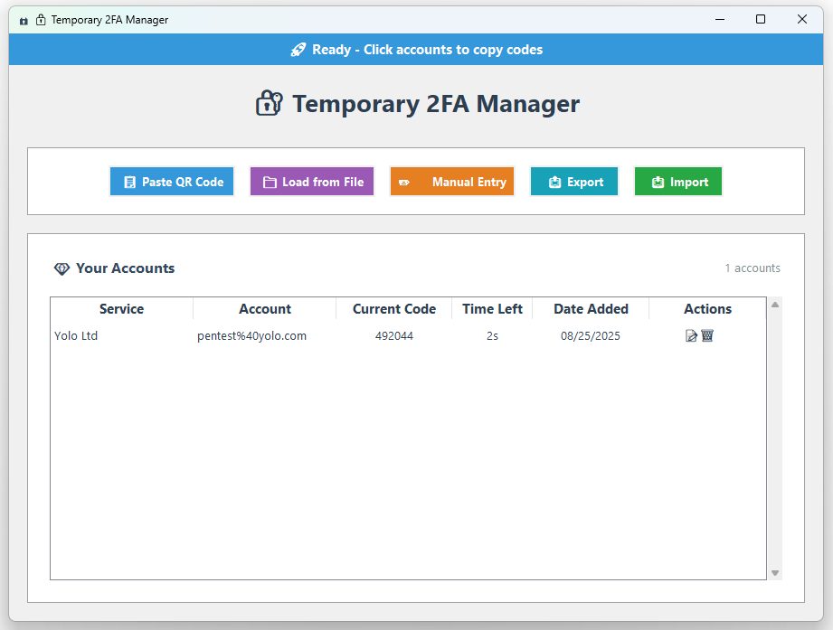

# 🔐 Temp 2FA Manager

Manage temporary 2FA codes on a PC, rather than bloating your phones authentication apps and forgetting about them.

## ✨ Features

- **🔍 QR Code Scanning**: Import 2FA secrets from QR codes via clipboard or file
- **📝 Manual Entry**: Add accounts manually with secret keys
- **🔄 Real-time Codes**: Automatic TOTP code generation and refresh
- **📋 One-click Copy**: Click any account to copy its current code to clipboard
- **✏️ Account Management**: Rename and delete accounts easily
- **📤 Import/Export**: Backup and restore your accounts
- **📱 Standard Compliant**: Works with all standard TOTP services

## 🖥️ Preview



## 🚀 Quick Start

### Prerequisites

- Python 3.8 or higher
- pip (Python package manager)

### Installation

1. **Clone or download this repository**
   ```bash
   git clone https://github.com/MrTurvey/temp2fa.git
   cd temp2fa
   ```

2. **Use the automated setup script**
   
   ```bash
   python setup.py
   ```

4. **Run the application**
   ```bash
   python temp2fa.py
   ```

## 📖 How to Use

### Adding Accounts

#### Method 1: QR Code from Clipboard
1. Copy a 2FA QR code image to your clipboard
2. Click **"📋 Paste QR Code"**
3. The app will automatically extract and save the account

#### Method 2: QR Code from File
1. Click **"📁 Load from File"**
2. Select an image file containing a QR code
3. The account will be added automatically

#### Method 3: Manual Entry
1. Click **"✏️ Manual Entry"**
2. Fill in:
   - **Service/Issuer**: Name of the service (e.g., "Google", "GitHub")
   - **Account Name**: Your username or email
   - **Secret Key**: The secret key provided by the service
3. Click **"✅ Add Account"**

### Managing Accounts

- **Copy Code**: Click anywhere on an account row to copy its current code
- **Rename**: Click the **📝** icon to rename the service or account name
- **Delete**: Click the **🗑️** icon to remove an account
- **Export**: Click **"📤 Export"** to save all accounts to a file
- **Import**: Click **"📥 Import"** to restore accounts from a backup file

## 🔒 Security Notice

**Important**: This application stores your 2FA secrets locally, without encryption. It is not designed to be secure, only use temporary 2FA tokens.

